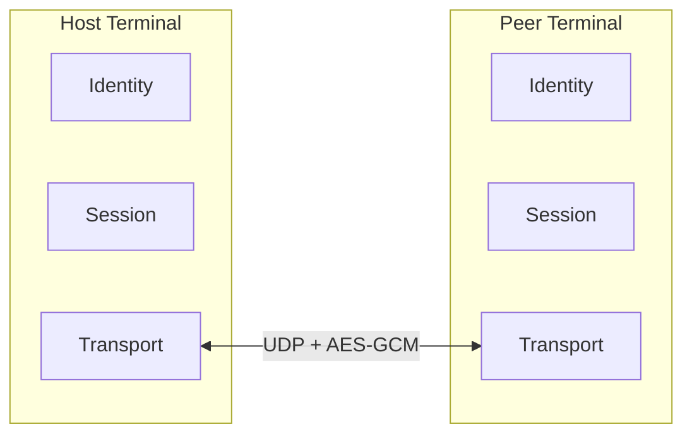
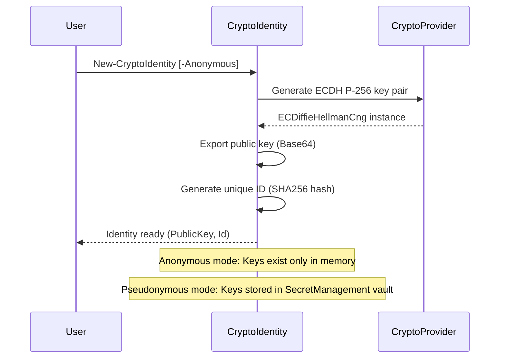
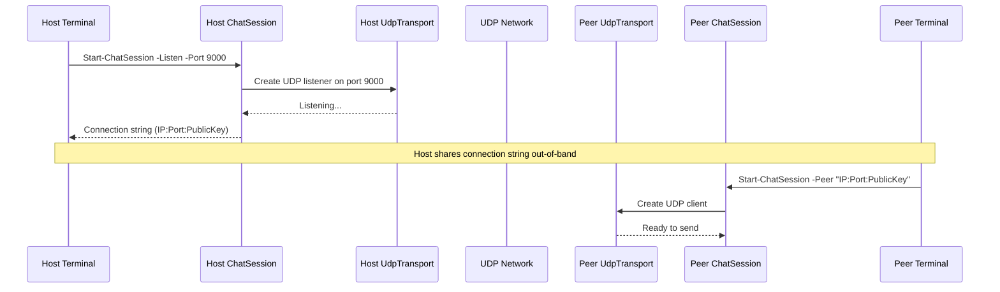
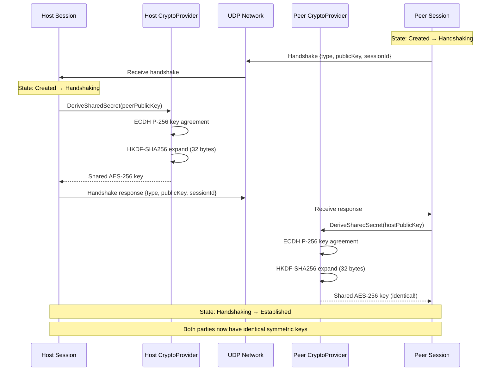
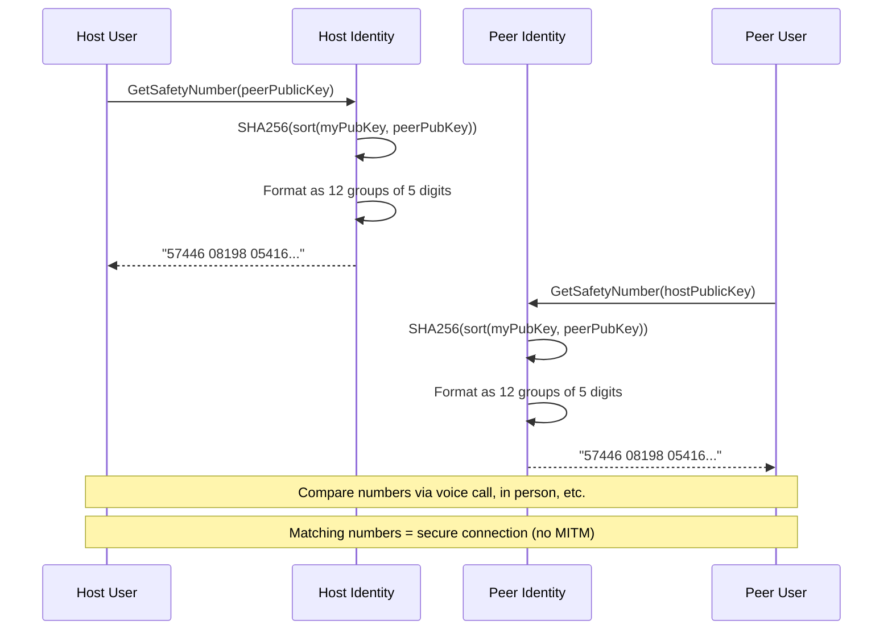
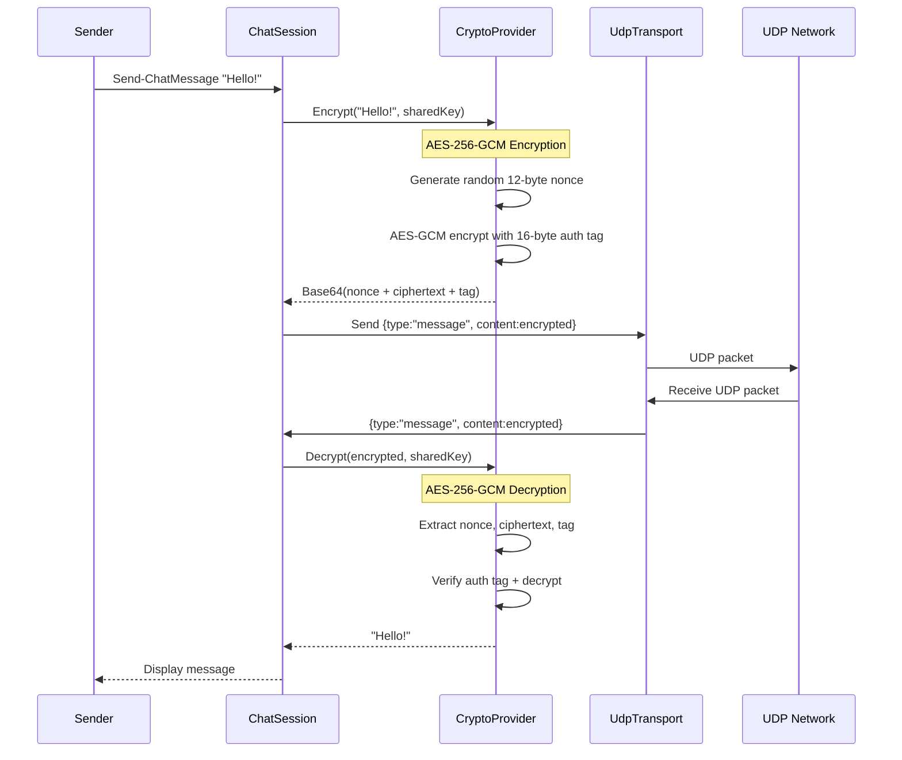
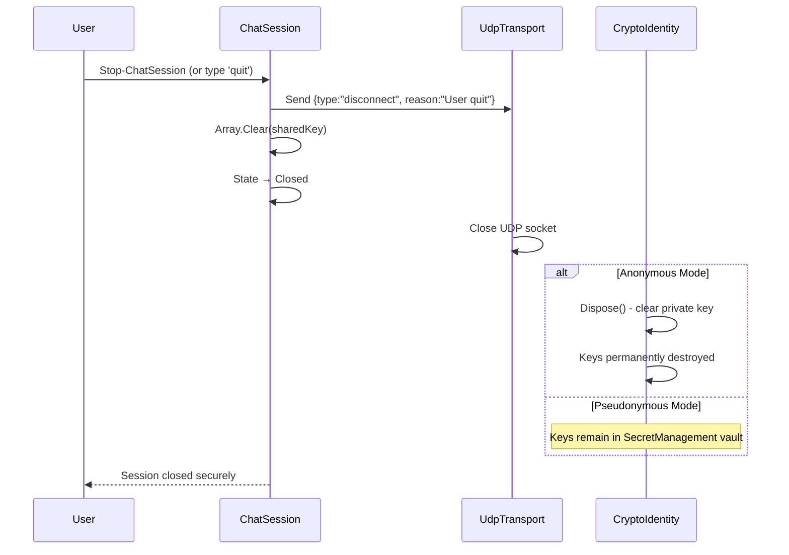
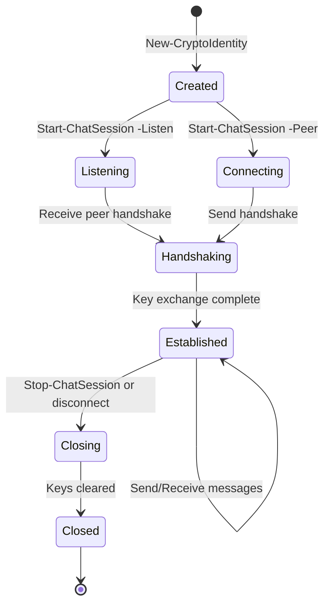

# PSCryptoChat Connection Flow

This document describes the complete journey of establishing an encrypted P2P chat session between a Host and Peer, including which components handle each step.

## Overview

PSCryptoChat uses a direct peer-to-peer architecture where two parties (Host and Peer) establish an encrypted channel without any central server.



## Component Responsibilities

| Component | File | Responsibility |
|-----------|------|----------------|
| **CryptoProvider** | `PSCryptoChat.psm1` | ECDH key generation, shared secret derivation, AES-GCM encrypt/decrypt, HKDF key derivation |
| **CryptoIdentity** | `PSCryptoChat.psm1` | Key pair management, public key export, safety number generation, optional SecretManagement persistence |
| **ChatSession** | `PSCryptoChat.psm1` | Session state machine, handshake orchestration, message encryption/decryption using derived keys |
| **UdpTransport** | `PSCryptoChat.psm1` | UDP socket management, packet send/receive, connection handling |
| **MessageProtocol** | `PSCryptoChat.psm1` | JSON message framing, message type handling (handshake, message, disconnect) |

## Connection Sequence

### Phase 1: Identity Creation

Both Host and Peer create cryptographic identities before connecting.



**Tech Stack:**
- `ECDiffieHellmanCng` (.NET CNG) - P-256 elliptic curve key generation
- `SHA256` - Identity ID derivation from public key
- `SecretManagement` (optional) - Persistent key storage

### Phase 2: Session Setup



**Tech Stack:**
- `UdpClient` (.NET) - UDP socket creation and binding
- Connection string format: `{IP}:{Port}:{Base64PublicKey}`

### Phase 3: ECDH Handshake

This is where the cryptographic magic happens - both parties exchange public keys and derive a shared secret.



**Tech Stack:**
- `ECDiffieHellman.DeriveKeyMaterial()` - Raw shared secret derivation
- `HKDF` (.NET) - Key derivation function with SHA-256
- JSON - Handshake message serialization

**Key Derivation Details:**
```
Raw Secret = ECDH(myPrivateKey, peerPublicKey)  // 32 bytes
AES Key = HKDF-Expand(Raw Secret, info="pscryptochat-v1", length=32)
```

### Phase 4: Safety Number Verification

Optional but recommended - users verify they're talking to the right person.



**Tech Stack:**
- `SHA256` - Combined key fingerprint
- Signal Protocol-style safety numbers for human verification

### Phase 5: Encrypted Messaging

Once established, all messages are encrypted with AES-256-GCM.



**Tech Stack:**
- `AesGcm` (.NET) - Authenticated encryption
- 12-byte nonce (random per message)
- 16-byte authentication tag (integrity + authenticity)
- JSON message protocol over UDP

**Message Format:**
```json
{
  "type": "message",
  "content": "BASE64(nonce || ciphertext || tag)",
  "timestamp": "2025-12-03T19:00:00Z"
}
```

### Phase 6: Session Termination

Secure cleanup ensures keys don't persist in memory.



**Tech Stack:**
- `Array.Clear()` - Zero out key material
- `IDisposable` pattern - Deterministic cleanup
- `SecretManagement` - Vault-based persistence (pseudonymous only)

## Complete Flow Diagram



## Security Properties

| Property | Implementation |
|----------|----------------|
| **Confidentiality** | AES-256-GCM encryption |
| **Integrity** | GCM authentication tag |
| **Authenticity** | ECDH key agreement + safety numbers |
| **Forward Secrecy** | New keys per session (anonymous mode) |
| **No Persistence** | Messages never written to disk |
| **Memory Safety** | Keys cleared with Array.Clear() on session end |

## Troubleshooting

### Handshake Fails
- Check firewall allows UDP on the specified port
- Verify both parties can reach each other's IP
- Ensure connection string was copied correctly

### Safety Numbers Don't Match
- Possible man-in-the-middle attack
- Terminate session immediately
- Re-establish on a trusted network

### Messages Not Received
- UDP is connectionless - no delivery guarantee
- Check network connectivity
- Verify session state is "Established"
